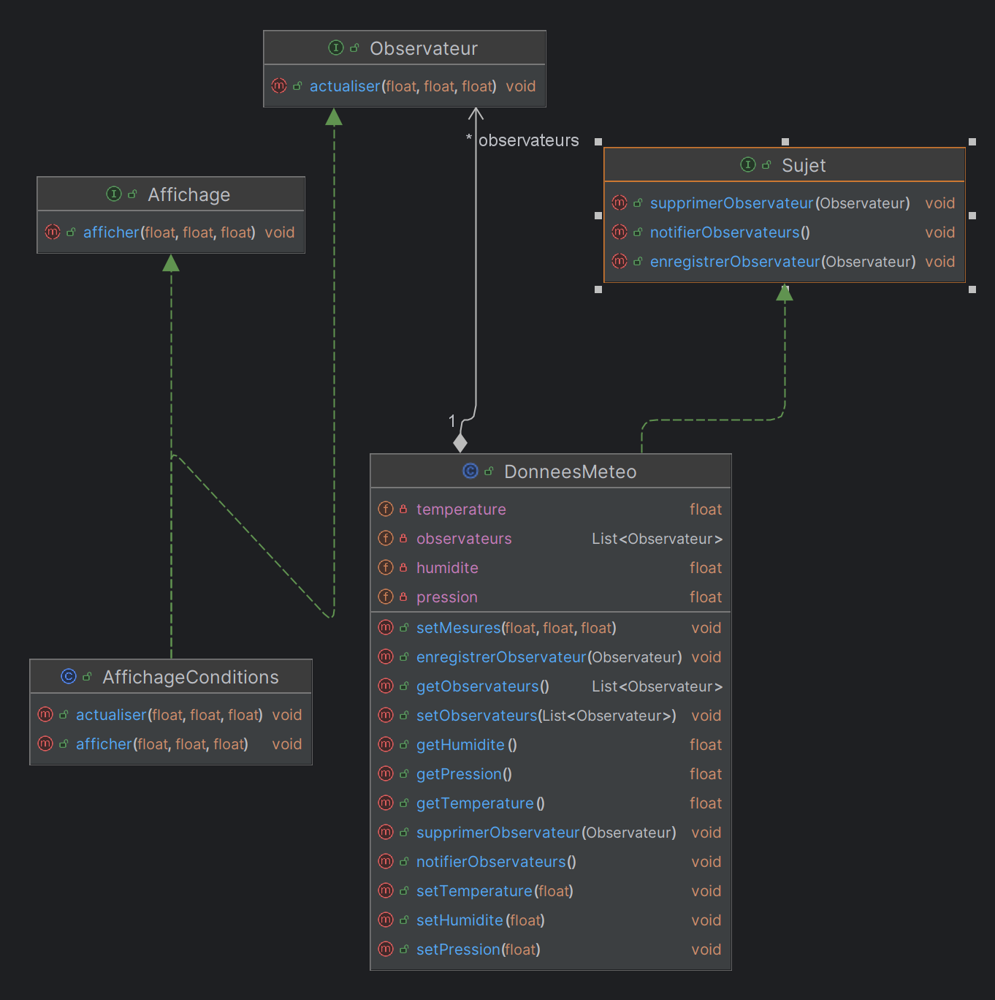

# 📊 Projet Station Météo
Ce projet est une implémentation du **design pattern Observer** permettant de gérer et d'afficher des
données météorologiques en temps réel. Les différents affichages s'abonnent aux mises à jour des données météo et
se mettent automatiquement à jour.

# Diagramme de Classe

